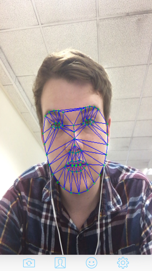
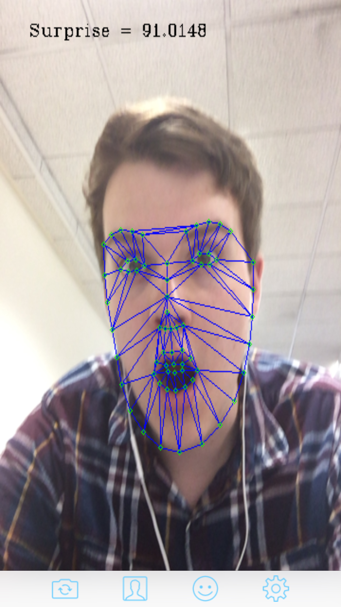
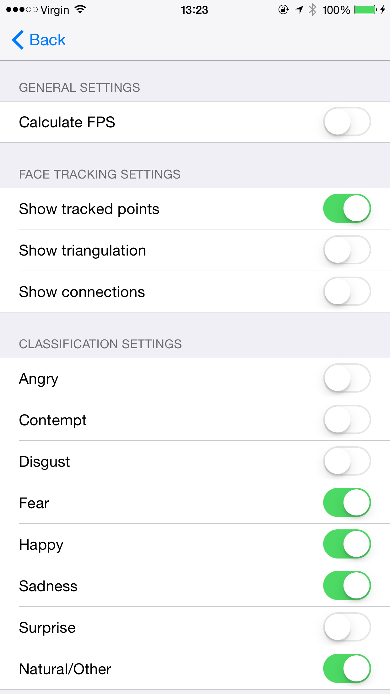

# Face tracking and emotion classification iOS app

iOS (iPhone/iPad) application developed during an 8-week [CUROP](http://learning.cf.ac.uk/curop/) research project at Cardiff University entitled 'Facial expression analysis on a smartphone'.

## Acknowledgements

This project has made use of the following work in order to build the app:
- [libSVM](https://www.csie.ntu.edu.tw/~cjlin/libsvm/)
- [FaceTracker library](https://github.com/kylemcdonald/FaceTracker)
- Tom Hartley's iOS FaceTracker app 
- Classification work by [Hristo Georgiev](https://github.com/hristogg1)
- Work completed by [Abhijat Biswas](https://github.com/ajdroid)

Supervision by [Professor A D Marshall](http://www.cs.cf.ac.uk/Dave/) and [Professor R.M. Whitaker](http://www.cs.cf.ac.uk/contactsandpeople/staffpage.php?emailname=r.m.whitaker), as well as the CUROP scheme itself  made this project possible.  

## Current functionality
- Facial landmark tracking of 66 points using the front/back camera 
- SVM classifier confidence values for the following emotions:
  - Anger
  - Contempt
  - Disgust 
  - Fear
  - Happy
  - Sadness
  - Surprise
  - Natural/Other

## Future improvements
- Optimise the emotion classifier feature space
- Retrain emotion classifier on more data
- Implement the ability to send tracking data to another device for other applications/analysis
- Investigate if any improvements can be made to the tracker library to increase FPS
- Improve the UI - particularly how results are displayed

## Screenshots
 
*Facial landmark tracking* 
 
*Surprise emotion detection with confidence value outputted* 
 
*Available in-app settings*

